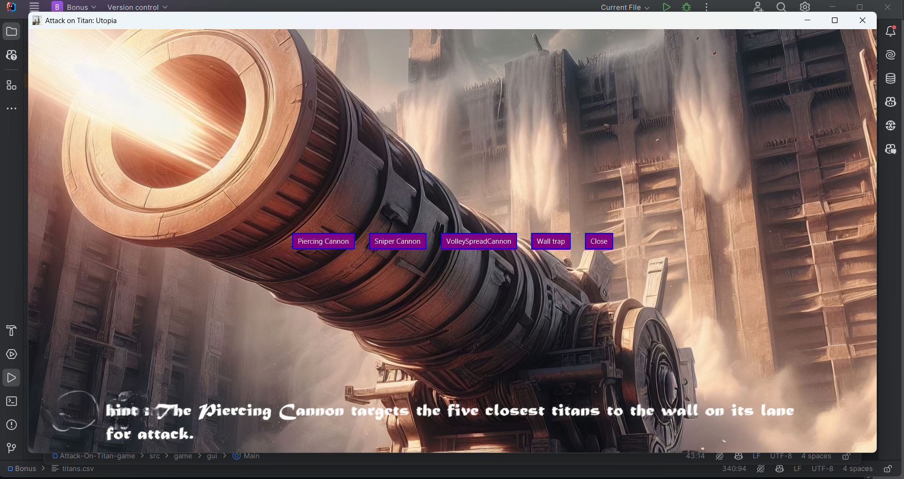

# Attack on Titan: Utopia

Welcome to Attack on Titan: Utopia, a one-player, endless tower defense game inspired by the anime Attack on Titan. Defend Utopia’s walls from invading titans by strategically deploying weapons and managing resources.

## Features

- **Two Game Modes:** Easy and Hard.
- **Dynamic GUI:** Reflects current game actions, scores, turns, and resources.
- **AI Integration:** Automates certain player actions and scores high compared to a normal player.
- **MVC Architecture:** Organized codebase for maintainability and scalability.
- **Extensive Use of JavaFX:** For building the GUI without Swing.

## Game Design Document

### Intro

Attack on Titan: Utopia is a one-player, endless tower defense game inspired by the hit anime Attack on Titan. The story revolves around titans, gigantic humanoid creatures that wiped out most of humanity. The remaining humans fled and hid behind three great walls. This game imagines a scenario where titans breach Wall Maria and reach the northern border of Wall Rose at the Utopia District. The human forces stationed in Utopia engage the titans in battle to prevent them from breaching Wall Rose.

### Space (Battle) Setting

The battlefield is divided into multiple lanes, each containing:
1. A part of the wall to be defended.
2. Weapons deployed by the player.
3. Titans attacking the wall.

Each lane has a danger level calculated based on the number and types of titans.

### Enemy Characters (Titans)

Titans have various attributes:
- **HP (Health Points):** The health of the titan.
- **Damage:** The damage inflicted on the wall.
- **Height:** Height in meters (does not affect gameplay).
- **Distance from Walls:** How far the titan is from the wall.
- **Speed:** Distance moved per turn.
- **Resources Value:** Resources gained by defeating the titan.
- **Danger Level:** Impact on the lane's danger level.

Special Titan Types:
- **Abnormal Titan:** Attacks twice per turn.
- **Armored Titan:** Takes only 25% of intended damage.
- **Colossal Titan:** Increases speed by 1 unit after each movement.

### Friendly Pieces (Weapons)

Weapons have various attributes:
- **Damage:** Inflicted on titans.
- **Price:** Resources needed to purchase.

Special Weapon Type:
- **Volley Spread Cannon:** Has min and max range attributes.

### Game Rules

- **Winning and Losing Conditions:** No winning condition; the game ends when all lanes are lost.
- **Titan Movement:** Titans move closer to the wall each turn.
- **Attack Actions:** Both titans and weapons perform attack actions each turn.
- **Defeated Targets:** Titans and wall parts can be defeated when HP drops to 0.
- **Approaching Titans:** Queue of titans to be added to lanes each turn.
- **Weapon Purchase:** Players can buy and deploy weapons using gathered resources.
- **Turn Actions:** Each turn involves player actions, titan movements, and attack actions.

### Game Flow

- **Initialization:** Game starts with a score of 0 and turn 1.
- **Phases:** The battle has three phases based on the number of turns: Early, Intense, and Grumbling.

## Setup Instructions

1. Clone the repository:
   ```bash
   git clone https://github.com/MostafaAhmed556/Attack-On-Titan-game.git
   ```
2. Open the project in your preferred IDE.
3. Ensure you have JavaFX installed.
4. Run the main class to start the game.

## Usage Instructions

- **Starting the Game:** Choose a game mode (Easy or Hard) and start playing.
- **Game Controls:** Use the GUI to manage resources, deploy weapons, and view game stats.
- **AI Feature:** Automate player actions by choosing the best action.

## Screenshots


*Start Menu*


*Titan Information*


*Weapon Information*


*Battle Walkthrough*

## Team Collaborators

- [Mostafa Ahmed](https://github.com/MostafaAhmed556)
- [Abdullah Mahmoud](https://github.com/Abdullah-Mahmoud557)
- [Mazen Said](https://github.com/Mazensead12345)

## License

This project is licensed under the MIT License.

---
